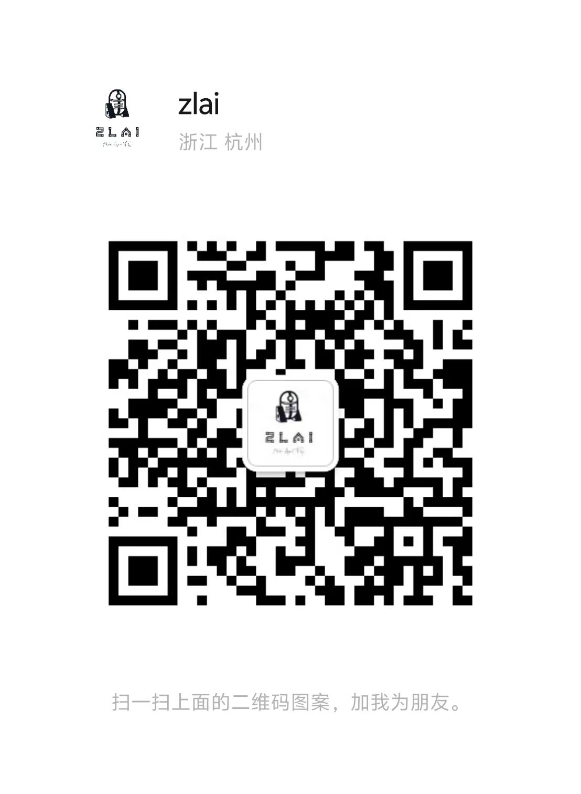

# ZLAI

[](https://pypi.org/project/zlai/)
[](https://pypi.python.org/pypi/zlai/)
[](https://pypi.org/project/zlai/)
[](https://star-history.com/#zlai-llm/zlai)
[](https://zlai-llm.github.io/zlai-doc/)
[](https://github.com/zlai-llm/zlai/issues/new/choose)
[](https://github.com/zlai-llm/zlai/issues/new/choose)
[](https://github.com/zlai-llm/zlai/blob/master/CONTRIBUTING.md)
[](https://github.com/zlai-llm/zlai/blob/master/LICENSE)

> 适配中文大模型的`Langchain-Agent`

## 简介

1. `LLM`: 调用大模型的便捷方法，包括本地大模型与线上大模型，其中包括主流大模型`API`，`GLM/Qwen/Yi/MoonShot`等100多种大模型。采用了统一的调用风格与方式，使得大模型调用更加便捷。
2. `Message`: 消息管理机制，方便管理`System/User/Assistant Message`，并进行大模型对话的记忆管理。
3. `Embedding`: 提供一系列向量化方法，包括本地与API向量化模型的调用，以及文本的各类向量化匹配、与向数据库对接等功能。
4. `RAG`: 提供一系列文档知识库问答方法。
5. `AgentTask`: 提供Agent任务流的调度，实现Agent任务的各种自动化流转。
6. `AgentTools`: 提供一系列Agent工具函数，实现更方便的Agent使用，如让大模型实现股票期货数据查询问答、数据分析作图等。
7. `Other`: 其他便捷方法。

[详细文档](https://zlai-llm.github.io/zlai-doc/#/)

-----

## 如何安装？

```bash
pip install zlai -U
```

您也可以在[GitHub](https://github.com/zlai-llm/zlai.git)/[PyPi](https://pypi.org/project/zlai/)查看最新代码与最新发行版本。

[Quick Start](https://zlai-llm.github.io/zlai-doc/#/quick_start)

-----

> Wechat

<center>

<h5>微信群</h5>
</center>

-----

> 待增加功能

- [ ] 增加对于多模态模型的支持，图片解读、文生图等
- [ ] 增加复杂任务的动态规划
- [ ] 增加Agent生成知识图谱
- [ ] 增加基金、股票、期货、期权等金融任务问答
  - [ ] 增加基金实时行情查询Agent
- [ ] 增加大模型风控相关内容，问答式分箱？
- [ ] 增加写代码然后执行问答
- [ ] 增加画图问答
- [ ] 增加其他Agent
- [ ] 增加React
- [ ] message prompt 的组织方式中的参数不能与 task completion 中的参数重名
- [ ] 对知识对话增加记忆机制，增加记忆机制在多个Agent之间的共享
  - [X] 完成`ChatAgent/Knowledge`

-----

> 0.3.96

1. 增加百川、百度、豆包大模型

> 0.3.90

1. 清理了一些代码
2. 增加了[LLM-SiliconCloud](https://cloud.siliconflow.cn/)全系列大模型

> 0.3.83

1. 增加了Tools-call
2. 修复了一些内容，增加了几个测试。

> 0.3.76

1. 增加了对于GLM4-API的支持
2. 增加了对Ali-Qwen2-API的支持
3. 增加了`PretrainedEmbedding`，用于提供预训练的向量化模型
4. 修改了其他bug.

-----
@2024/03/27
